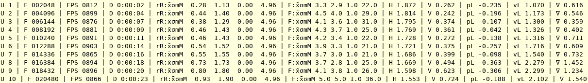
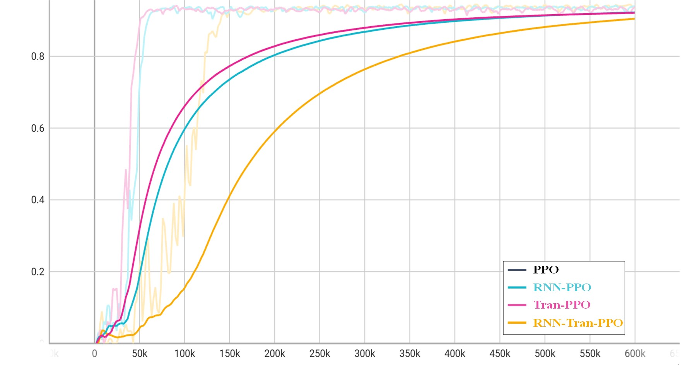
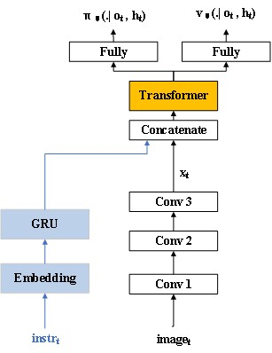

# “Memory-Augmented Deep Reinforcement Learning for Robust Autonomous Agent Navigation” Starter Files

Memory-Augmented Deep Reinforcement Learning for Robust Autonomous Agent Navigation starter files in order to immediatly train, visualize and evaluate an agent **without writing any line of code**.

<p align="center">
    
</p>

These files are suited for [`minigrid`](https://github.com/Farama-Foundation/Minigrid) environments and [`torch-ac`](https://github.com/lcswillems/torch-ac) RL algorithms,and [`rl-starter-files-master`](https://github.com/lcswillems/rl-starter-files)baseline. They are easy to adapt to other environments and RL algorithms. 
## Features
- **Script to train**, including:
  - Log in txt, CSV and Tensorboard
  - Save model
  - Stop and restart training
  - Use  Tran-PPO algorithms


## Installation

1. Clone this repository.

2. Install `minigrid` environments and `torch-ac` RL algorithms and  `rl-starter-files-master`baseline:

```
pip install -r requirements.txt
```

**Note:** If you want to modify `torch-ac` algorithms, you will need to rather install a cloned version, i.e.:
```
git clone https://github.com/lcswillems/torch-ac.git
cd torch-ac
pip install -e .
```

## Example of use

Train, visualize and evaluate an agent on the `MiniGrid-DoorKey-5x5-v0` environment:

<p align="center"></p>

1. Train the agent on the `MiniGrid-DoorKey-5x5-v0` environment with Tran-PPO algorithm:

```
python -m train.py --algo ppo --env MiniGrid-DoorKey-5x5-v0 --model DoorKey --save-interval 10 --frames 600000
```

<p align="center"></p>

2. Visualize agent's training behavior:

```
tensorboard --logdir=/home/BabyAiServer/rl-starter-files-master/storage/DoorKey5x5/G600K
```

<p align="center"></p>


## Files

This package contains:
- scripts to:
  - train an agent \
  in `script/train.py` ([more details](#scripts-train))
  - visualize agent's behavior \
- a default agent's model \
in `model.py` ([more details](#model))
- utilitarian classes and functions used by the scripts \
in `utils`

These files are suited for [`minigrid`](https://github.com/Farama-Foundation/Minigrid) environments and [`torch-ac`](https://github.com/lcswillems/torch-ac) RL algorithms. They are easy to adapt to other environments and RL algorithms by modifying:
- `model.py`
- `utils/format.py`


<h2 id="model">model.py</h2>

The default model is discribed by the following schema:

<p align="center"></p>


This model can be easily adapted to your needs.
